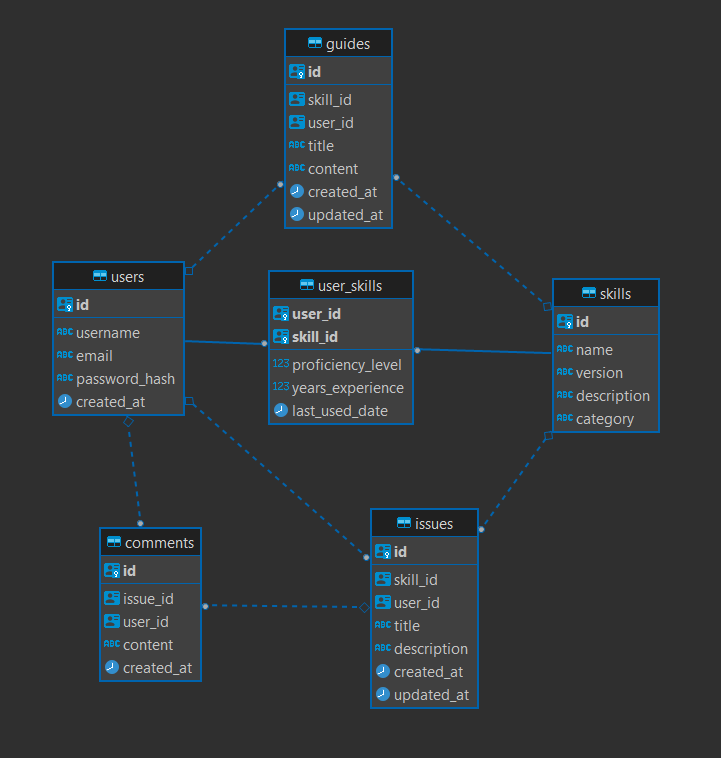

# Technical Skills Registry System

https://github.com/ivangarciaquintela/HACKUDC25

run:
docker compose down && docker compose up --build

A system for registering and querying personal technical competencies.

The services will be available at:

- Frontend: http://localhost
- API: http://localhost:8000
- Database: localhost:5432

## TODO

xan issues:

- delete own from issues
- issue.html
- skill version dropdown

- profile page
- [ ] API to add and query stufff

- fix logout

- request partuicular skill
- ultimas skills añadidas
- Skill groups or paths (e.g., "Full Stack Developer" track)
- Skill recommendations based on existing skills

- Frontend:
  - tab selected
  - search bar updated when searching + enter for seaching

## Project Structure

```
.
├── backend/
│   ├── app/
│   │   └── main.py
│   ├── Dockerfile
│   └── requirements.txt
├── frontend/
│   ├── static/
│   │   └── style.css
│   ├── templates/
│   │   └── index.html
│   ├── Dockerfile
│   └── nginx.conf
├── database/
│   └── init/
├── docker-compose.yml
└── README.md
```

## Environment Variables

The following environment variables are used:

### Database

- POSTGRES_USER: admin
- POSTGRES_PASSWORD: password123
- POSTGRES_DB: skills_db

### API

- DATABASE_URL: postgresql://admin:password123@db:5432/skills_db
- SECRET_KEY: your-secret-key-here

## Security Note

For production deployment, make sure to:

1. Change all default passwords
2. Use proper secret management
3. Configure proper CORS settings
4. Enable SSL/TLS
5. Set up proper authentication mechanisms

## Database Diagram



## De la charla de Gradiant

- Reconocimiento de items similares (vectorizar+cosine distance??)
- entrada natural language para input de items
- Comprobar si en lo de los formularios se crean las skillls nuevas
- ontología / taxonomía de skills. si sabes de un item hijo infiere que sabes de un ítem padre
- ranking de conocimentos: sumas de profficiency de los items por ej?? para saber quien sabe más de un tema
-
